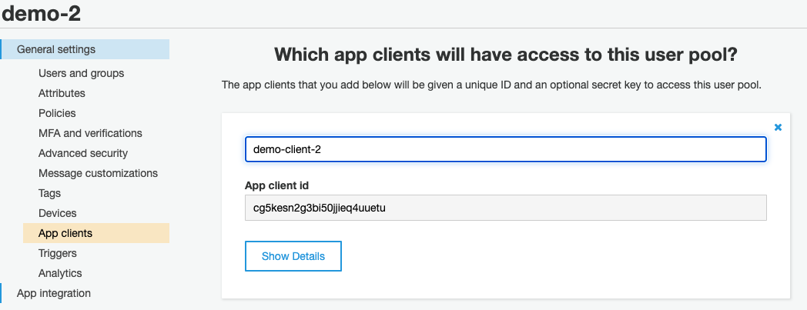

# user pool use case

## use user pool when you need:

* [Design **sign-up** and **sign-in** webpages for your app](https://aws.amazon.com/premiumsupport/knowledge-center/cognito-hosted-web-ui/)
* [Access and **manage user data**](https://docs.aws.amazon.com/cognito/latest/developerguide/user-pool-settings-attributes.html)
* **Track user** device, location, and IP address, and [adapt to sign-in requests of different risk level](https://docs.aws.amazon.com/cognito/latest/developerguide/cognito-user-pool-settings-adaptive-authentication.html)
* Use [a custom **authentication** flow](https://docs.aws.amazon.com/cognito/latest/developerguide/amazon-cognito-user-pools-authentication-flow.html#amazon-cognito-user-pools-custom-authentication-flow) for your app


[login page example](http://busy-squirrels-login.s3-website-us-east-1.amazonaws.com/)


The login page was created using a template that implemented all the functionalities that Cognito user pool provides. You only need to pick the functionalities that you need for your own project.&#x20;


[useful user pool template](https://github.com/RomanKosobrodov/aws-cognito-js-example)


.png>)

replace the **UserPoolId** and **ClientId** of yours in **authentication.js** file

```javascript
function getPoolData(){
	return {
			UserPoolId: localStorage["aws-congnito-user-pool-id"],
			ClientId: localStorage["aws-congnito-app-id"] 
		};
}
```


create your own user pool and set up the clientId yourself




here is your UserPoolId

.png>)


[Reference video for connecting user pool](https://www.youtube.com/watch?v=0Wsov5vePjo\&ab\_channel=101apps.co.za)

